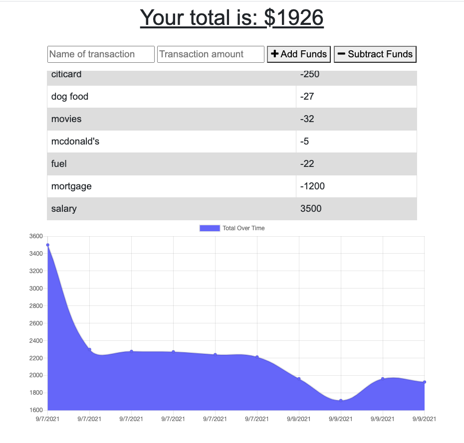

# Budget-Tracker
This is a progressive app that allows the user to manage their budget whether they are online or offline.

## Table of Contents
  - [Installation](#installation)
  - [Features](#features)
  - [Project Links](#links)
  - [Contributing](#contributing)
  - [Credits](#credits)
  - [License](#license)

  ## Installation
  Once you clone this repository, you will need to follow these steps:
  1. Connect to your mongoose server. 
  2. Install the node modules, by running npm install.
  3. To start the app, type `node server` in the terminal.
  
  ## Features
  The user can add transactions as deposits or expenses by entering the following:

    * Name of transaction
    * Transaction amount
    * For deposits - select Add Funds
    * For expenses - select Subtract Funds
    * The total budeget balance is calculated as soon as funds are entered

  Screenshots of app:
  

The graph portrays the total funds over time by date entered for each transaction
  ### Links
  Project Links:
  - [Github Repo](https://github.com/larafoster/Budget-Tracker) 

  View this app on Heroku:
  - [Heroku - Budget Tracker](https://budget-tracker-lara.herokuapp.com/)

  ## Credits 
  This project is created with the following technologies:
  - [Node.js](https://nodejs.org/en/) 
  - [Express.js](https://expressjs.com/) 
  - [MongoDB Atlas](https://cloud.mongodb.com/)
  - [IndexedDb](https://developer.mozilla.org/en-US/docs/Web/API/IndexedDB_API/Using_IndexedDB) 

  ## Contribute
   Please feel free to fork this project and create your own branch. Any suggestions for improvement are welcomed.

 ## License
 This project is licensed under the MIT License

   
  
  ## Questions
  Contact me if you have any questions about this project:

  - [Send me an email](mailto:larafoster.dev@gmail.com)
